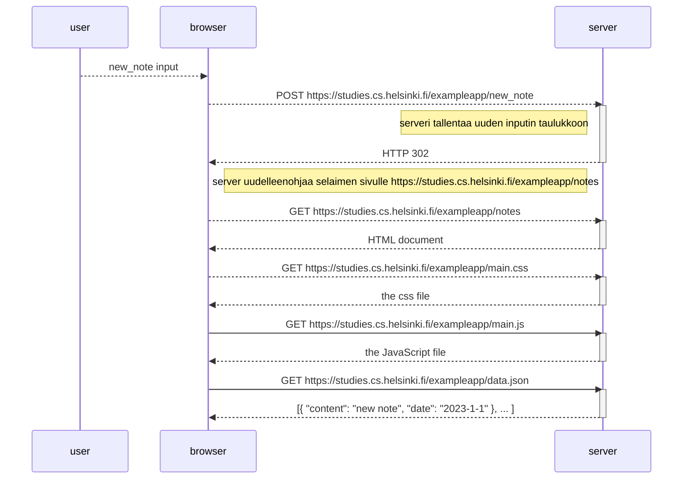

```mermaid
sequenceDiagram
  participant user
  participant browser
  participant server

  user-->>browser: new_note input
  browser-->>server: POST https://studies.cs.helsinki.fi/exampleapp/new_note
  activate server
  Note left of server: serveri tallentaa uuden inputin taulukkoon
  server-->>browser: HTTP 302
  deactivate server
  Note left of server: server uudelleenohjaa selaimen sivulle https://studies.cs.helsinki.fi/exampleapp/notes

  browser-->>server: GET https://studies.cs.helsinki.fi/exampleapp/notes
  activate server
  server-->>browser: HTML document
  deactivate server

  browser-->>server: GET https://studies.cs.helsinki.fi/exampleapp/main.css
  activate server
  server-->>browser: the css file
  deactivate server
    
  browser->>server: GET https://studies.cs.helsinki.fi/exampleapp/main.js
  activate server
  server-->>browser: the JavaScript file
  deactivate server

  browser->>server: GET https://studies.cs.helsinki.fi/exampleapp/data.json
  activate server
  server-->>browser: [{ "content": "new note", "date": "2023-1-1" }, ... ]
  deactivate server    
```
  

  

  
